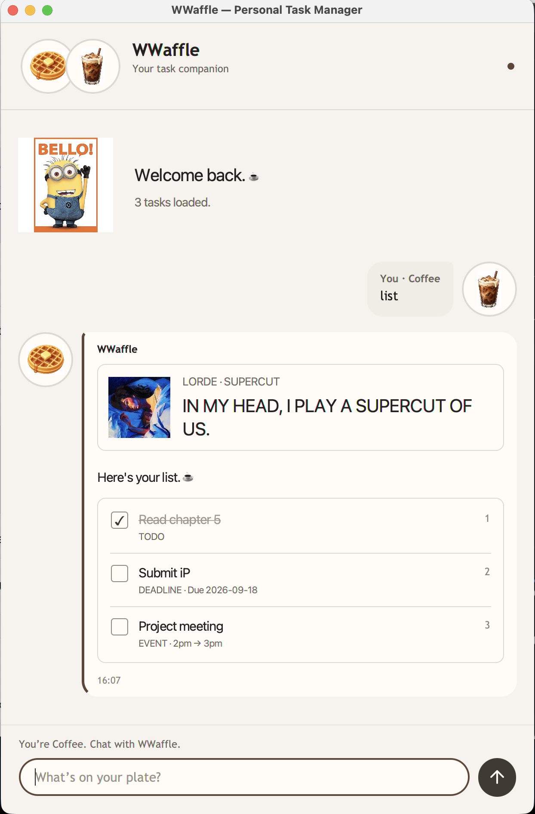

# WWaffle

WWaffle is a desktop task manager with a warm café identity, checklist-style task replies,
and occasional music references. Type short commands to manage todos, deadlines, and events.

## Quick start

1. Install Java **25** and check it with `java -version`.
2. Download `wwaffle.jar` from this repository's latest release.
3. Put the JAR in a folder where you can create files.
4. Open a terminal in that folder and run `java -jar wwaffle.jar`.
5. Enter a command in the text box and press Enter or click Send.

Tasks are saved automatically to `data/wwaffle.txt`, relative to the folder from which
Java is launched. Launch from the same folder to reopen the same task list. Images and fonts
are bundled inside the JAR; normal operation does not require an internet connection.

## Commands

Replace placeholders such as `DESCRIPTION` and `N` with your own values. Do not type the
placeholder names literally. Task commands are lowercase. Extra spaces and tabs are accepted
and normalized to single spaces. Blank GUI input is ignored.

| Action | Format | Example |
| --- | --- | --- |
| Add a todo | `todo DESCRIPTION` | `todo Read chapter 5` |
| Add a deadline | `deadline DESCRIPTION /by YYYY-MM-DD` | `deadline Submit report /by 2026-09-18` |
| Add an event | `event DESCRIPTION /from START /to END` | `event Meeting /from 2pm /to 3pm` |
| Show tasks | `list` | `list` |
| Complete task | `mark N` | `mark 2` |
| Reopen task | `unmark N` | `unmark 2` |
| Delete task | `delete N` | `delete 2` |
| Find by description | `find KEYWORD` | `find book` |
| Sort alphabetically | `sort name` | `sort name` |
| Sort unfinished first | `sort status` | `sort status` |
| Clear all tasks | `clear` | `clear` |
| Greet WWaffle | `hi`, `hello`, `hey`, `hey there` | `hello` |
| Thank WWaffle | `thanks`, `thank you` | `thanks` |
| Exit | `bye`, `goodbye`, `see you`, `see you next time` | `bye` |

### Adding tasks

`todo Read chapter 5` displays **Task added. 🧁**, the new task, and the total count.
Deadlines require a real calendar date; `2026-02-30` is rejected. Events accept free-text
start/end labels (for example `Monday morning`); WWaffle does not validate their chronological
order. Use `/by`, `/from`, and `/to` once each in their documented positions. The pipe character
`|` is reserved for the save-file format and is not accepted in task commands.

Successful deadline and event replies include compact music artwork. These cards are visual
references only; WWaffle does not play audio. Long lyrics and descriptions wrap with the window.

### Listing and completing tasks

`list` displays task numbers, descriptions, task types, and dates/times. Completed descriptions
are muted and struck through. Checklist markers are read-only: use `mark N` or `unmark N` to
change completion status. Replies are snapshots; run `list` again to see the latest state.

Task numbers are **one-based**. Deletion and sorting can change numbers. Always run `list`
before modifying a task if you are unsure of its current number.

### Search

`find book` matches descriptions containing `book`, ignoring case. Multiple words are treated
as one phrase. Search results use checklist rows with the task’s actual command number. Sorting
can change these numbers; use the newest response before marking or deleting.

### Sorting

`sort name` sorts descriptions alphabetically, ignoring case. `sort status` places unfinished
tasks before completed tasks. Both preserve the order of tied tasks and save the new order.
Sorting is performed once: later additions are appended rather than automatically sorted.

### Clearing the list

`clear` permanently removes every task and saves the empty list. WWaffle replies **Cleared!**
with a celebration image. This command takes no additional arguments.

### Exiting

Goodbye commands show a brief Minion reaction, then close the window after approximately
1.4 seconds. Saving occurs after each successful change, not only at exit.

## Errors and recovery

- **Missing or invalid arguments:** read the error hint, correct the command, and retry.
- **Task number not found:** use `list` and choose an existing number.
- **Missing data file:** a new installation starts empty and creates the file after the first change.
- **Malformed or unreadable data file:** editing is blocked to protect the original. Back up the
  file, repair or restore it, and restart WWaffle. Do not delete your only copy of saved tasks.
- **Save failure:** the command reports an error and restores the previous in-memory list.
  Check that the launch folder is writable and there is sufficient disk space, then retry.
- **Different tasks after launching:** check the terminal's current folder; it determines the data path.
- **Java version error:** run `java -version` and select Java 25.

Duplicate tasks are allowed. Event times are free text. There is no undo command.

## Credits

See [Credits](credits.md) for the starter template, AI collaboration, fonts, and supplied artwork.
